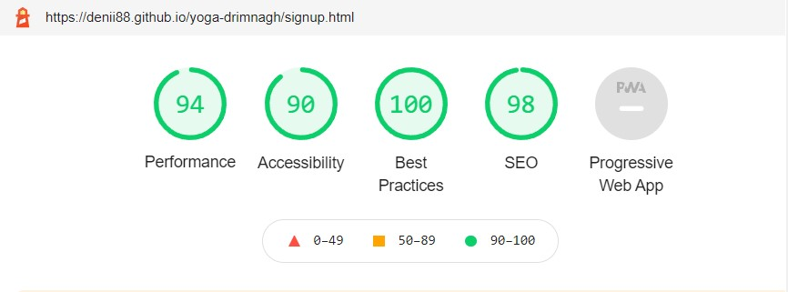

# Yoga Drimnagh

[Live webpage](https://denii88.github.io/yoga-drimnagh/)
## User goals
- Find close studio to the people from Drimnagh and around,there are no studios fo practicing Yoga
- On line classes available
- Location clearly stated
- Practice videos to try at home

## Owner Goals
- Promote newly established business
- Attract more customers with online presence, classes and subscriptions

## Target Audience
- People around Dublin 12 area looking for Yoga classes
- People which are already customers of the gym
- Groups of older people who wants to be active
- On line classes so people can do it form their homes

## User Stories
### For the first time users

1.As a first time user, I want to know where is gym located

2.As a first time user, I want to know what do you offer

3.As a first time user, I want to know the prices

4.As a first time user, I want to see the reviews

### For returning users

5.As a returning user, I want to know leave a comment or a review

6.As a returning user, I want to know is there any offers

7.As a returning user, I want to get know the trainers and teachers

8.As a returning user, I want to follow you on social media

### For the owners

9.As a site owner, I want to communicate with my customers

10.As a site owner, I want to know what are good and bad comments 

11.As a site owner, I want people to know about the offers and any changes

## Wireframes
[Balsamiq wireframe home](docs/balsamiq-wireframe-one.jpg)

[Balsamiq wireframe training](docs/balsamiq-wireframe-two.jpg)

[Balsamiq wireframe signup](docs/balsamiq-wireframe-three.jpg)

## Features

### Navigation bar
- On all three sites, Home, Training and Sign Up
- Responsive and easy to navigate

### Logo and home image
- Logo when clicked on any page, is taking user back to the home page
- Decorated and in style with footer
- Home page photo showing one of the classes with mixed group of people, from 20 - 70 years of age

### Short benefits of Yoga and why us 

- Included font awesome icons to make it more appealing

### Contact number with clear map and address of location, map is interactive and clickable same as contact number

### Footer
- When clicked on any of the icons, the site will open in a new tab

### Training page with videos

### Customer reviews
- These are actual customer reviews for the gym that yoga is renting space
- I am in good relations with the owner so I asked could I use those reviews just for this purpose, to make it look more attractive for new customers

### Form with subscribe button 
- All entry fields are required, except the subscribe button
- If left empty the browser will show the message "Please fil in this field"

## Features for future
- Times, prices, video testimonials

## Technologies used

### Languages
- HTML
- CSS

### Tools
- Git
- GitHub
- Gitpod
- Pexels
- Google Fonts
- Font Awesome
- Balsamiq
- Validators for HTML and CSS
- Lighthouse
- Dev tools
- Stack Overflow

## Validation and Testing
- The website itself is working properly. No errors in loading of any pages, gome page and logo works, videos are working and have commands.
- Contact number ans the map are interactive 
- Footer links are taking user to the new tab
- Form is working and all field must be entered before submitting
- Project is working on different sizes of devices
- Tested on Iphone12, Samsung Galaxy20 and Samsung Galaxy tablet

### Validator Testing
  
  - HTML- Passed the official [W3C validator](https://validator.w3.org/)
  - CSS- Passed the official [Jigsaw validator](https://jigsaw.w3.org/css-validator/)

  ### Browsers supported

  - Tested on Google Chrome
  - Mozilla Firefox 
  - Safari

  ### Performance
  - I took the code to the Lighhouse feature in Google Chrome tools and the result is following:

  
  

